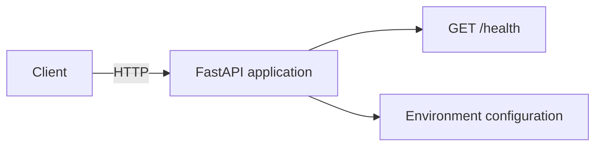

# Architecture

## Current foundation

The initial CodeNex backend exposes a small FastAPI service with a health
endpoint. Runtime settings are read from the environment through
`pydantic-settings`, keeping deployment configuration separate from source
code.

## Planned direction

CodeNex is intended to take software requirements through an agentic workflow:
understanding, planning, implementation, execution, testing, analysis, repair,
and retesting. Agent orchestration, model-provider integrations, persistence,
sandboxing, and frontend functionality are deliberately outside this
repository-foundation milestone.
